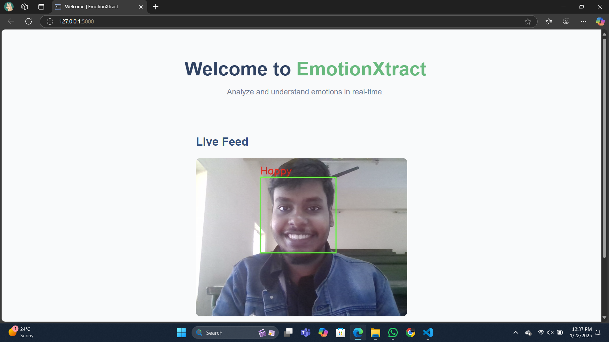
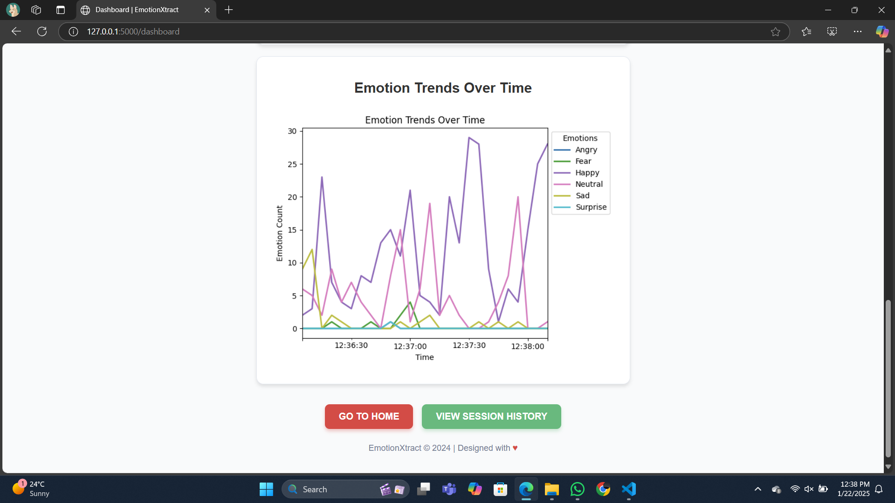

# EmotionXtract - Emotion Detection

This project is an end-to-end emotion detection system that identifies human facial expressions in real time.  
It uses a **CNN model** trained on the **FER-2013** dataset and a **Flask-based web dashboard** to visualize predictions.

## Dataset
- **Name:** FER-2013 (Facial Expression Recognition)
- **Size:** ~35,000 labeled images
- **Source:** Kaggle  
  https://www.kaggle.com/datasets/ananthu017/emotion-detection-fer  
- The dataset includes 48x48 pixel grayscale images categorized into:
  - Angry  
  - Disgust  
  - Fear  
  - Happy  
  - Neutral  
  - Sad  
  - Surprise  
## Screenshots





## Tech Stack

- **Python**
- **TensorFlow / Keras**
- **OpenCV**
- **Flask**
- **NumPy, Pandas, Matplotlib**

## Project Structure
```bash
EmotionXtract/
│
├── app/                 # Flask application logic (routes, processing)
│
├── data/                # Dataset (FER-2013)
│
├── model/               # Trained CNN model (.h5)
│
├── static/              # Frontend assets
│   ├── css/
│   ├── js/
│   └── images/
│
├── templates/           # HTML templates for Flask (UI screens)
│
├── app.py               # Main Flask entry point
├── train_model.py       # Script to train the CNN model
├── preprocess.py        # Data loading + preprocessing utilities
└── requirements.txt
```
## Model Architecture
The emotion classifier is a Convolutional Neural Network (CNN) tailored for the FER-2013-style input (48×48 grayscale images) and 7 emotion classes:  
`Angry, Disgust, Fear, Happy, Neutral, Sad, Surprise`.

### Overview
- **Input:** `48 x 48 x 1` (grayscale)  
- **Output:** Softmax over `7` classes  
- **Initializer:** `HeNormal`  
- **Activation:** `LeakyReLU` (alpha=0.1) for convolutional and dense blocks  
- **Normalization:** `BatchNormalization` after conv / dense blocks  
- **Regularization:** `Dropout` after pooling and dense layers  
- **Optimizer:** `Adam` (default lr = 1e-3)  
- **Loss:** `categorical_crossentropy`  
- **Metric:** `accuracy`

---

### Layer-by-layer (concise)

| Block | Layer details |
|---|---|
| **Block 1** | `Conv2D(32, 3x3, padding='same')` → `LeakyReLU` → `BatchNorm` → `Conv2D(32, 3x3)` → `LeakyReLU` → `BatchNorm` → `MaxPool(2x2)` → `Dropout(0.25)` |
| **Block 2** | `Conv2D(64, 3x3, padding='same')` → `LeakyReLU` → `BatchNorm` → `Conv2D(64, 3x3)` → `LeakyReLU` → `BatchNorm` → `MaxPool(2x2)` → `Dropout(0.30)` |
| **Block 3** | `Conv2D(128, 3x3, padding='same')` → `LeakyReLU` → `BatchNorm` → `Conv2D(128, 3x3)` → `LeakyReLU` → `BatchNorm` → `MaxPool(2x2)` → `Dropout(0.35)` |
| **FC Head** | `Flatten()` → `Dense(256)` → `LeakyReLU` → `BatchNorm` → `Dropout(0.4)` → `Dense(128)` → `LeakyReLU` → `BatchNorm` → `Dropout(0.4)` → `Dense(7, softmax)` |

---

### Recommended hyperparameters & training tips

- **Batch size:** 32 – 128 (try 64 as a start)  
- **Epochs:** 40 – 80 (use early stopping on validation loss)  
- **Learning rate:** start at `1e-3` with a scheduler (step decay or `ReduceLROnPlateau`)  
- **Augmentation:** random rotations (±15°), horizontal flip, small shifts and zooms — FER images are small and noisy, augmentation helps generalization  
- **Callbacks:** `EarlyStopping(patience=8)`, `ReduceLROnPlateau(factor=0.5, patience=3)` or a `LearningRateScheduler`  
- **Class imbalance:** if present, consider class weights or oversampling

---

