<div align="center">


[](https://git.io/typing-svg)

<br/>

[](https://python.org)
[](https://tensorflow.org)
[](https://opencv.org)
[](https://flask.palletsprojects.com)
[](https://www.kaggle.com/datasets/ananthu017/emotion-detection-fer)
[]()

> *End-to-end facial emotion recognition — from raw pixels to real-time predictions* 🎭

</div>

---

## 📋 Table of Contents

<div align="center">

| | | |
|:---:|:---:|:---:|
| [🎯 About](#-about) | [📦 Dataset](#-dataset) | [🧠 Model Architecture](#-model-architecture) |
| [🔄 System Flow](#-system-flow) | [🛠️ Tech Stack](#%EF%B8%8F-tech-stack) | [📁 Project Structure](#-project-structure) |
| [📸 Screenshots](#-screenshots) | [🚀 Getting Started](#-getting-started) | [⚙️ Training Tips](#%EF%B8%8F-training-tips) |

</div>

---

## 🎯 About

**EmotionXtract** is an end-to-end emotion detection system that identifies human facial expressions in real time. It uses a **CNN model** trained on the **FER-2013** dataset and a **Flask-based web dashboard** to visualize predictions live.

<div align="center">

| 🏷️ Emotion | 🏷️ Emotion | 🏷️ Emotion | 🏷️ Emotion |
|:---:|:---:|:---:|:---:|
| 😡 Angry | 🤢 Disgust | 😨 Fear | 😊 Happy |
| 😐 Neutral | 😢 Sad | 😲 Surprise | |

</div>

---

## 📦 Dataset

<div align="center">

| Property | Details |
|:---:|:---|
| 📛 Name | **FER-2013** (Facial Expression Recognition) |
| 📊 Size | ~35,000 labeled images |
| 🔗 Source | [Kaggle — FER-2013](https://www.kaggle.com/datasets/ananthu017/emotion-detection-fer) |
| 🖼️ Format | 48×48 pixel **grayscale** images |
| 🏷️ Classes | 7 emotion categories |

</div>

---

## 🧠 Model Architecture

### CNN Block Diagram

```mermaid
flowchart TD
    A([🖼️ Input\n48 × 48 × 1 Grayscale]):::input

    subgraph B1[🔷 Block 1 — Feature Extraction]
        direction TB
        B1A[Conv2D 32 filters 3×3 same]:::conv
        B1B[LeakyReLU α=0.1]:::act
        B1C[BatchNorm]:::norm
        B1D[Conv2D 32 filters 3×3]:::conv
        B1E[LeakyReLU α=0.1]:::act
        B1F[BatchNorm]:::norm
        B1G[MaxPool 2×2]:::pool
        B1H[Dropout 0.25]:::drop
        B1A --> B1B --> B1C --> B1D --> B1E --> B1F --> B1G --> B1H
    end

    subgraph B2[🔶 Block 2 — Deeper Features]
        direction TB
        B2A[Conv2D 64 filters 3×3 same]:::conv
        B2B[LeakyReLU α=0.1]:::act
        B2C[BatchNorm]:::norm
        B2D[Conv2D 64 filters 3×3]:::conv
        B2E[LeakyReLU α=0.1]:::act
        B2F[BatchNorm]:::norm
        B2G[MaxPool 2×2]:::pool
        B2H[Dropout 0.30]:::drop
        B2A --> B2B --> B2C --> B2D --> B2E --> B2F --> B2G --> B2H
    end

    subgraph B3[🔴 Block 3 — High-Level Features]
        direction TB
        B3A[Conv2D 128 filters 3×3 same]:::conv
        B3B[LeakyReLU α=0.1]:::act
        B3C[BatchNorm]:::norm
        B3D[Conv2D 128 filters 3×3]:::conv
        B3E[LeakyReLU α=0.1]:::act
        B3F[BatchNorm]:::norm
        B3G[MaxPool 2×2]:::pool
        B3H[Dropout 0.35]:::drop
        B3A --> B3B --> B3C --> B3D --> B3E --> B3F --> B3G --> B3H
    end

    subgraph FC[🟣 Fully Connected Head]
        direction TB
        F1[Flatten]:::flat
        F2[Dense 256]:::dense
        F3[LeakyReLU + BatchNorm]:::act
        F4[Dropout 0.40]:::drop
        F5[Dense 128]:::dense
        F6[LeakyReLU + BatchNorm]:::act
        F7[Dropout 0.40]:::drop
        F8[Dense 7 — Softmax]:::out
        F1 --> F2 --> F3 --> F4 --> F5 --> F6 --> F7 --> F8
    end

    Z([🎭 Output\n7 Emotion Classes]):::output

    A --> B1 --> B2 --> B3 --> FC --> Z

    classDef input  fill:#1A237E,color:#fff,stroke:none
    classDef output fill:#1B5E20,color:#fff,stroke:none
    classDef conv   fill:#0D47A1,color:#fff,stroke:none
    classDef act    fill:#4A148C,color:#fff,stroke:none
    classDef norm   fill:#006064,color:#fff,stroke:none
    classDef pool   fill:#BF360C,color:#fff,stroke:none
    classDef drop   fill:#37474F,color:#fff,stroke:none
    classDef flat   fill:#33691E,color:#fff,stroke:none
    classDef dense  fill:#1A237E,color:#fff,stroke:none
    classDef out    fill:#1B5E20,color:#fff,stroke:none
```



---

### Layer-by-Layer Summary

<div align="center">

| Block | Layer Details |
|:---:|:---|
| 🔷 **Block 1** | `Conv2D(32, 3×3, same)` → `LeakyReLU` → `BatchNorm` → `Conv2D(32, 3×3)` → `LeakyReLU` → `BatchNorm` → `MaxPool(2×2)` → `Dropout(0.25)` |
| 🔶 **Block 2** | `Conv2D(64, 3×3, same)` → `LeakyReLU` → `BatchNorm` → `Conv2D(64, 3×3)` → `LeakyReLU` → `BatchNorm` → `MaxPool(2×2)` → `Dropout(0.30)` |
| 🔴 **Block 3** | `Conv2D(128, 3×3, same)` → `LeakyReLU` → `BatchNorm` → `Conv2D(128, 3×3)` → `LeakyReLU` → `BatchNorm` → `MaxPool(2×2)` → `Dropout(0.35)` |
| 🟣 **FC Head** | `Flatten` → `Dense(256)` → `LeakyReLU` → `BatchNorm` → `Dropout(0.4)` → `Dense(128)` → `LeakyReLU` → `BatchNorm` → `Dropout(0.4)` → `Dense(7, softmax)` |

</div>

**Model Config:**

```
Input Shape  :  48 × 48 × 1
Output       :  Softmax over 7 classes
Initializer  :  HeNormal
Optimizer    :  Adam  (lr = 1e-3)
Loss         :  categorical_crossentropy
Metric       :  accuracy
```

---

## 🔄 System Flow


---

## 🛠️ Tech Stack

<div align="center">

| Layer | Technology |
|:---:|:---:|
| 🐍 Language |  |
| 🧠 Deep Learning |   |
| 👁️ Computer Vision |  |
| 🌐 Web Dashboard |  |
| 📊 Data & Viz |    |

</div>

---

## 📁 Project Structure

<details>
<summary><b>📂 Click to expand</b></summary>

```
EmotionXtract/
│
├── 🌐 app/                  # Flask application logic (routes, processing)
│
├── 📦 data/                 # Dataset (FER-2013)
│
├── 🧠 model/                # Trained CNN model (.h5)
│
├── 🎨 static/               # Frontend assets
│   ├── css/
│   ├── js/
│   └── images/
│
├── 🖼️ templates/            # HTML templates for Flask UI
│
├── app.py                   # Main Flask entry point
├── train_model.py           # Script to train the CNN model
├── preprocess.py            # Data loading + preprocessing utilities
└── requirements.txt
```

</details>

---

## 📸 Screenshots

<div align="center">

| 🖥️ Dashboard | 🎭 Prediction Output |
|:---:|:---:|
|  |  |

</div>

---

## 🚀 Getting Started

**1️⃣ Clone the repository**
```bash
git clone https://github.com/GeetishM/EmotionXtract.git
cd EmotionXtract
```

**2️⃣ Install dependencies**
```bash
pip install -r requirements.txt
```

**3️⃣ Download the FER-2013 dataset**

Place the dataset in the `data/` folder. Download from:
[Kaggle — FER-2013](https://www.kaggle.com/datasets/ananthu017/emotion-detection-fer)

**4️⃣ Train the model**
```bash
python train_model.py
```

**5️⃣ Run the Flask dashboard**
```bash
python app.py
```

Then open `http://localhost:5000` in your browser.

---

## ⚙️ Training Tips

<details>
<summary><b>📈 Recommended Hyperparameters & Callbacks (click to expand)</b></summary>

<br/>

| Parameter | Recommended Value |
|:---|:---|
| Batch Size | `64` (range: 32–128) |
| Epochs | `40–80` with early stopping |
| Learning Rate | Start at `1e-3` with scheduler |
| Augmentation | ±15° rotation, H-flip, small shifts & zooms |

**Callbacks to use:**
```python
EarlyStopping(patience=8, monitor='val_loss')
ReduceLROnPlateau(factor=0.5, patience=3)
```

> 💡 FER images are small and noisy — **augmentation significantly helps generalization**. If class imbalance is present, use class weights or oversampling.

</details>

---

## 👥 Collaborators

<div align="center">

<table>
  <tr>
      <td align="center">
      <a href="https://github.com/anamikadey099">
        <br/>
        <b>Anamika Dey</b>
      </a>
    </td>
    <td align="center">
      <a href="https://github.com/GeetishM">
        <br/>
        <b>Geetish Mahato</b>
      </a>
    </td>
   </tr>
</table>

</div>

---

<div align="center">

*Built with 🧠 + ❤️ by the EmotionXtract team*

⭐ If this project helped you, consider giving it a star!


</div>
